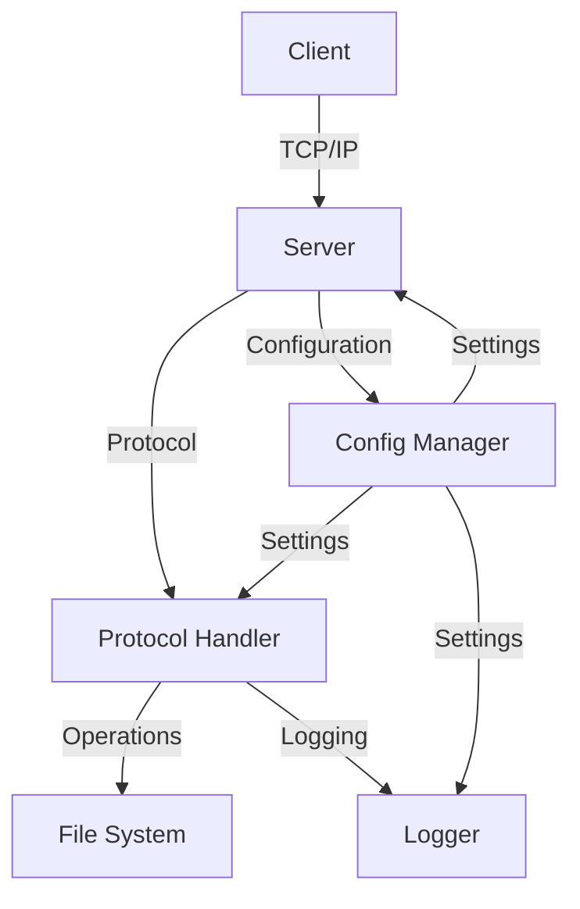

# CileServer Architecture

## Overview

CileServer is a high-performance, multi-threaded file server designed for efficient file operations over a network. Built with modularity and scalability in mind, it provides a robust platform for file sharing and management.

## System Design

### Core Components

1. **Main Module** (`src/main.c`)
   - Server lifecycle management
   - Command-line interface
   - Signal handling
   - Component initialization
   - Shutdown coordination

2. **Server Module** (`src/server.c`)
   - Socket management
   - Connection handling
   - Thread management
   - Request routing
   - Resource cleanup

3. **Protocol Module** (`src/protocol.c`)
   - Binary protocol implementation
   - Message parsing
   - Response generation
   - Error handling
   - Protocol validation

4. **File Operations** (`src/file_ops.c`)
   - File system operations
   - Path validation
   - Security checks
   - Resource management
   - Error handling

5. **Configuration** (`src/config.c`)
   - Configuration loading
   - Runtime settings
   - Default values
   - Validation
   - Persistence

6. **Logger** (`src/logger.c`)
   - Log management
   - Level control
   - File rotation
   - Thread safety
   - Performance optimization

7. **Client** (`src/client.c`)
   - Command-line interface
   - Protocol implementation
   - Error handling
   - User feedback
   - Progress reporting

## System Architecture

### Component Interaction



### Data Flow

1. **Connection Establishment**
   - Client initiates TCP connection
   - Server accepts and creates thread
   - Authentication (if enabled)
   - Session initialization

2. **Request Processing**
   - Client sends binary request
   - Protocol handler validates and parses
   - Request routed to appropriate handler
   - File operation executed
   - Response generated and sent

3. **Resource Management**
   - Thread pool management
   - Connection limits
   - Memory allocation
   - File descriptor handling
   - Cleanup procedures

## Threading Model

### Thread Types

1. **Main Thread**
   - Server initialization
   - Signal handling
   - Connection acceptance
   - Shutdown coordination

2. **Worker Threads**
   - Client request handling
   - File operations
   - Response generation
   - Resource cleanup

3. **Background Threads**
   - Log rotation
   - Statistics collection
   - Resource monitoring

### Synchronization

- Mutexes for shared resources
- Condition variables for coordination
- Atomic operations for counters
- Thread-local storage where appropriate

## Directory Structure

```
cileserver/
├── config/              # Configuration files
│   ├── cileserver.conf
│   └── cileserver.conf.example
├── docs/                # Documentation
├── include/             # Header files
├── logs/                # Log files
├── src/                 # Source code
├── test_files/          # Test files
├── tests/               # Test scripts
├── .gitignore
├── install.sh           # Installation script
├── Makefile             # Legacy build system
├── meson.build          # Meson build system
└── README.md
```

## Security Considerations

1. **Authentication**
   - Optional user authentication
   - Secure credential storage
   - Session management

2. **Authorization**
   - File permission checks
   - Path validation
   - Operation restrictions

3. **Data Protection**
   - Input validation
   - Buffer overflow prevention
   - Secure file handling

## Performance Optimization

1. **Resource Management**
   - Connection pooling
   - Thread reuse
   - Memory efficiency
   - File descriptor limits

2. **I/O Optimization**
   - Efficient buffer management
   - Batch operations
   - Asynchronous I/O where possible
   - Caching strategies

3. **Scalability**
   - Horizontal scaling support
   - Load balancing
   - Resource monitoring
   - Performance metrics 