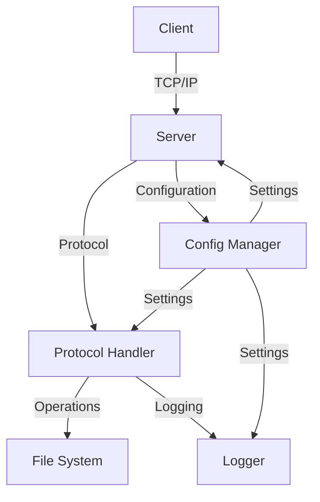

# Server

## Overview

CileServer is a high-performance, multi-threaded file server implemented in C. It provides a robust platform for file operations over a custom binary protocol, with a focus on efficiency, security, and reliability.

## Design

### Architecture

The server follows a modular design with clear separation of concerns:

1. **Main** (`src/main.c`)
   - Server lifecycle management
   - Command-line interface
   - Signal handling
   - Component initialization
   - Shutdown coordination

2. **Server** (`src/server.c`)
   - Socket management
   - Connection handling
   - Thread management
   - Request routing
   - Resource cleanup

3. **Protocol** (`src/protocol.c`)
   - Binary protocol implementation
   - Message parsing
   - Response generation
   - Error handling
   - Protocol validation

4. **Files** (`src/file_ops.c`)
   - File system operations
   - Path validation
   - Security checks
   - Resource management
   - Error handling

5. **Config** (`src/config.c`)
   - Configuration loading
   - Runtime settings
   - Default values
   - Validation
   - Persistence

6. **Logger** (`src/logger.c`)
   - Log management
   - Level control
   - File rotation
   - Thread safety
   - Performance optimization

### Flow



## Threads

### Model

The server uses a hybrid threading model:

1. **Main Thread**
   - Server initialization
   - Signal handling
   - Connection acceptance
   - Shutdown coordination

2. **Worker Threads**
   - Client request handling
   - File operations
   - Response generation
   - Resource cleanup

3. **Background Threads**
   - Log rotation
   - Statistics collection
   - Resource monitoring

### Sync

- Mutexes for shared resources
- Condition variables for coordination
- Atomic operations for counters
- Thread-local storage where appropriate

## Config

### File

The server configuration file (`config/cileserver.conf`) supports:

```ini
# Server settings
port = 8080
max_connections = 100
root_directory = /var/cileserver

# Security
enable_auth = true
auth_file = /etc/cileserver/auth.conf

# Logging
log_level = INFO
log_file = /var/log/cileserver.log
```

### Options

| Option | Type | Default | Description |
|--------|------|---------|-------------|
| port | int | 8080 | Server port |
| max_connections | int | 100 | Maximum concurrent connections |
| root_directory | string | /var/cileserver | Server root directory |
| enable_auth | bool | false | Enable authentication |
| auth_file | string | | Authentication file path |
| log_level | string | INFO | Log level (DEBUG, INFO, WARNING, ERROR) |
| log_file | string | | Log file path |

### Runtime

Configuration can be modified at runtime through:

1. **Command Line**
   ```bash
   ./cileserver -p 8080 -c /path/to/config.conf
   ```

2. **API**
   ```c
   set_config_int("max_connections", 200);
   set_config_string("log_level", "DEBUG");
   ```

## Security

### Auth

1. **Users**
   - Optional authentication
   - Secure credential storage
   - Session management

2. **Access**
   - File permission checks
   - Path validation
   - Operation restrictions

3. **Data**
   - Input validation
   - Buffer overflow prevention
   - Secure file handling

## Performance

### Optimization

1. **Resources**
   - Connection pooling
   - Thread reuse
   - Memory efficiency
   - File descriptor limits

2. **I/O**
   - Efficient buffer management
   - Batch operations
   - Asynchronous I/O where possible
   - Caching strategies

3. **Scale**
   - Horizontal scaling support
   - Load balancing
   - Resource monitoring
   - Performance metrics

### Tuning

1. **Threads**
   ```ini
   # config/cileserver.conf
   worker_threads = 4
   max_connections = 100
   ```

2. **Memory**
   ```ini
   # config/cileserver.conf
   buffer_size = 8192
   max_memory = 256M
   ```

3. **I/O**
   ```ini
   # config/cileserver.conf
   async_io = true
   batch_size = 64K
   ```

## Monitoring

### Logs

The server provides comprehensive logging:

```
[2024-04-09 14:30:45] [INFO] Server started on port 8080
[2024-04-09 14:31:02] [WARNING] Client connection timeout
[2024-04-09 14:31:15] [ERROR] Failed to write file: Permission denied
```

### Stats

Runtime statistics include:
- Active connections
- Memory usage
- I/O operations
- Error rates
- Response times

## API

### Server

```c
// Initialize server
int init_server(void);

// Start server
int start_server(void);

// Stop server
void stop_server(void);

// Get server status
server_status_t get_server_status(void);
```

### Config

```c
// Load configuration
int load_config(const char *path);

// Get configuration value
int get_config_int(const char *key, int *value);
int get_config_string(const char *key, char *value, size_t size);

// Set configuration value
int set_config_int(const char *key, int value);
int set_config_string(const char *key, const char *value);
```

### Files

```c
// File operations
int read_file(const char *path, void *buffer, size_t size, size_t *read);
int write_file(const char *path, const void *data, size_t size);
int delete_file(const char *path);
int list_directory(const char *path, file_info_t *entries, int max, int *count);
```

## Debug

### Tools

1. **Logs**
   ```bash
   tail -f /var/log/cileserver.log
   ```

2. **Stats**
   ```bash
   ./cileserver --stats
   ```

3. **Debug Mode**
   ```bash
   ./cileserver --debug
   ```

### Common Issues

1. **Connection**
   - Check port availability
   - Verify firewall settings
   - Test network connectivity

2. **Performance**
   - Monitor resource usage
   - Check for bottlenecks
   - Optimize configuration

3. **Errors**
   - Review error logs
   - Check permissions
   - Verify configuration 